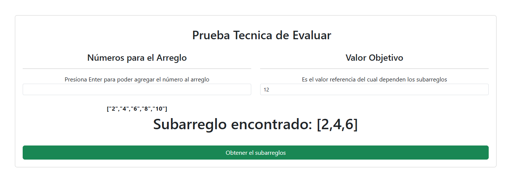

# Documentación: Encuentra el Subarreglo de Longitud Máxima con Suma Igual al Objetivo, Documentacion del Back-End

## Descripción
Esta función en Python encuentra el subarreglo de longitud máxima dentro de un arreglo de números enteros cuya suma sea igual a un número objetivo dado. Si no se encuentra ningún subarreglo que cumpla con la condición, la función devuelve una lista vacía.

---

## Sintaxis
```python
get_target_num(listNumber, target)
```

### Argumentos
- `listNumber` (list): Lista de números enteros.
- `target` (int): Número objetivo para la suma.

### Retorno
- `list`: El subarreglo de longitud máxima cuya suma sea igual al objetivo, o una lista vacía `[]` si no se encuentra ningún subarreglo.

---

## Implementación
```python
def get_target_num(listNumber, target):
    max_length = 0
    subarray = []
    
    for start in range(len(listNumber)):
        current_sum = 0
        for end in range(start, len(listNumber)):
            current_sum += listNumber[end]
            
            if current_sum == target:
                current_length = end - start + 1
                
                if current_length > max_length:
                    max_length = current_length
                    subarray = listNumber[start:end + 1]
                    
    return subarray if max_length > 0 else []
```

---

## Ejemplo de Uso

```python
# Ejemplo 1: Subarreglo encontrado
listNumber = [2, 4, 6, 8, 10]
target = 12

result = get_target_num(listNumber, target)
print(f"El subarreglo es: {result}, para el objetivo: {target}")
```
**Salida:**
```
El subarreglo es: [2, 4, 6], para el objetivo: 12
```

```python
# Ejemplo 2: Sin subarreglo válido
listNumber = [-3, -7, -2, -5, -8]
target = -10

result = get_target_num(arr, target)
print(f"El subarreglo es: {result}, para el objetivo: {target}")
```
**Salida:**
```
El subarreglo es: [-3, -7], para el objetivo: -10
```

---

## Notas Adicionales
- Si hay múltiples subarreglos con la misma longitud máxima que cumplen con la condición, la función devuelve el primer subarreglo encontrado.
- Asegúrate de probar el algoritmo con diferentes combinaciones de entradas para verificar su robustez.


---
---
---

# Guía de Usuario: Funcionalidad del Front-End

Esta guía está diseñada para ayudar a los usuarios a interactuar con la interfaz web de manera fácil y eficiente. La aplicación permite ingresar un conjunto de números y un valor objetivo para encontrar subarreglos cuya suma sea igual al valor objetivo.

## Descripción General

La aplicación permite ingresar una lista de números y un valor objetivo. Una vez ingresados, el sistema buscará subarreglos dentro de esa lista cuya suma total sea igual al valor objetivo. Si se encuentra un subarreglo que cumpla con esa condición, se mostrará al usuario.

## Pasos para Usar la Aplicación

### Paso 1: Ingresar los Números en el Arreglo

1. **Ubicación**: La sección "Números para el Arreglo" se encuentra en la mitad izquierda de la pantalla.
2. **¿Qué hacer?**: Ingrese un número en el campo de texto y presione la tecla **Enter**.
3. **¿Qué sucede?**: El número se agrega automáticamente al arreglo y se muestra debajo en tiempo real.

   - **Ejemplo**: Si ingresa `5` y presiona **Enter**, el arreglo mostrará `[5]`.
   - Puede seguir ingresando más números y el sistema irá agregándolos al arreglo.

4. **Visualización**: El arreglo de números se muestra justo debajo del campo de entrada, en formato JSON. Por ejemplo: `"[5, -2, 3, 8]"`.

### Paso 2: Ingresar el Valor Objetivo

1. **Ubicación**: La sección "Valor Objetivo" se encuentra en la mitad derecha de la pantalla.
2. **¿Qué hacer?**: Ingrese el valor objetivo (número de referencia) que desea usar para encontrar los subarreglos.
3. **¿Qué sucede?**: Si el campo no está vacío, el botón "Obtener Subarreglos" se hará visible, permitiéndole proceder al siguiente paso.

   - **Ejemplo**: Si ingresa `10`, este será el valor objetivo que utilizará para buscar los subarreglos.

### Paso 3: Obtener el Subarreglo

1. **Ubicación**: El botón "Obtener Subarreglos" se encuentra debajo de ambos campos de entrada.
2. **¿Qué hacer?**: Después de ingresar los números y el valor objetivo, haga clic en el botón "Obtener Subarreglos".
3. **¿Qué sucede?**: El sistema buscará subarreglos cuyo sumatorio sea igual al valor objetivo que ingresó.

   - Si se encuentra un subarreglo válido, verá una alerta con el subarreglo encontrado, por ejemplo: `Subarreglo encontrado: [5, -2, 3, 8]`.
   - Si no se encuentra ningún subarreglo, verá un mensaje de error indicando: `No se encontró ningún subarreglo.`.

## Detalles Técnicos

Aunque no es necesario entender cómo funciona el código para usar la aplicación, a continuación se explica brevemente cómo se procesa la información en el backend:

1. **Ingreso de Números**: Los números que ingrese se agrupan en un arreglo.
2. **Búsqueda del Subarreglo**: El sistema recorre el arreglo para encontrar los subarreglos cuya suma sea igual al valor objetivo que proporcionó.
3. **Respuesta**: El sistema devolverá el primer subarreglo que cumpla con la condición. Si no hay ningún subarreglo válido, el sistema notificará que no se ha encontrado ningún resultado.

## Consejos Útiles

- **Asegúrese de que los números sean válidos**: Solo se deben ingresar números (enteros). Los valores no numéricos no se agregarán al arreglo.
- **Recuerde que el valor objetivo debe ser numérico**: El sistema necesita un número válido para buscar los subarreglos.
- **Se pueden ingresar números negativos**: El sistema es capaz de manejar números negativos sin problema.

## Ejemplo Práctico

Imagina que ingresa los siguientes números: `[1, -2, 1, 1, -1, 2, 4]` y su valor objetivo es `3`. El sistema buscará subarreglos cuya suma sea igual a 3. Si se encuentra un subarreglo válido, lo mostrará, como por ejemplo: `[1, -2, 1, 1, -1, 2]`.

---

## Resumen

Esta aplicación le permite ingresar una lista de números y un valor objetivo, para luego encontrar subarreglos cuya suma sea igual al valor objetivo. Con una interfaz sencilla, podrá ver en tiempo real el arreglo y obtener rápidamente los resultados. ¡Es fácil de usar y no requiere conocimientos técnicos!

### Vista de la Aplicacion



### Consulta por medio de POSTMAN
Para realizar